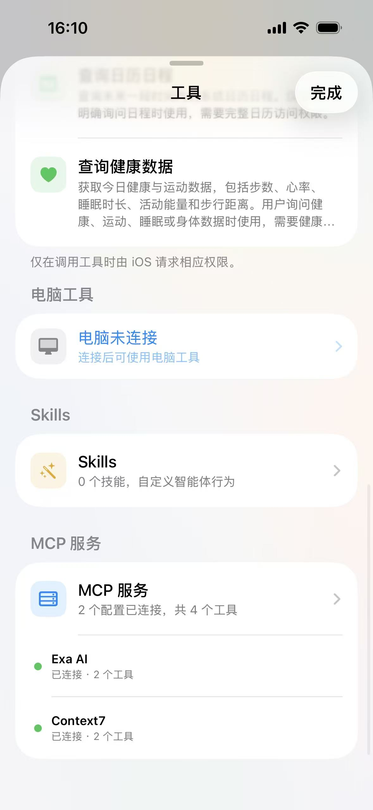
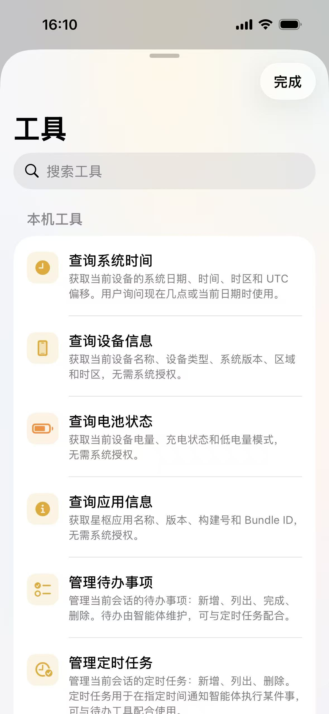
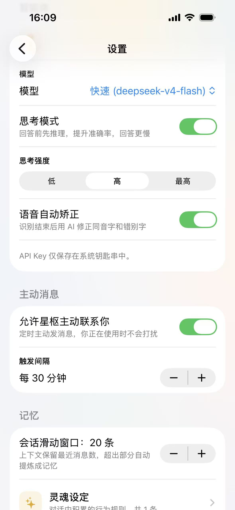
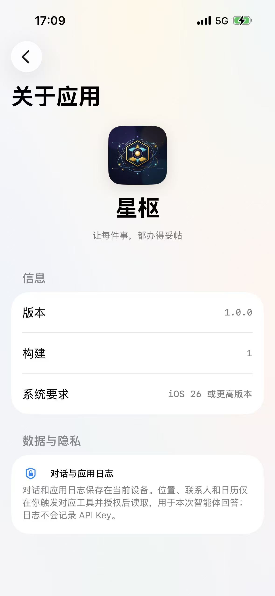

# 笔笔 iOS（bibi-ios）

笔笔（bibi）的 iOS 端——AI 记账助手。SwiftUI 原生实现（iOS 26，Liquid Glass 设计语言），LLM 对话、流式解析与 function calling 全部自实现，可通过局域网连接电脑端（bibi）解锁记账工具。

## 功能特性

- **AI 对话**：DeepSeek API，SSE 流式响应 + 多轮 tool calling（上限 8 轮），思考过程展示
- **本地工具**：时间、设备信息、定位、联系人、日历、健康数据、待办、定时任务等（系统权限按需申请）
- **电脑联动**：Bonjour 自动发现电脑端 → 配对码认证 → 调用电脑端记账工具（流水查询、报表、预算等，工具列表随 PC 端启用的 Skill 动态变化）
- **语音输入**：系统语音识别实时转写
- **智能体记忆**：灵魂设定（soul）/ 用户画像（user_profile）/ 长期记忆（long_term）三类，支持"记住…"指令与会话摘要提取
- **定时任务与主动消息**：AI 驱动的前台到期提醒与主动联系
- **多用户**：本地多用户隔离，连接电脑后可加载远程用户

## 界面预览

<p align="center">
    
    
    
</p>
<p align="center">
    
    
</p>

## 技术栈

| 分类 | 选型 |
|------|------|
| UI | SwiftUI（iOS 26.0+，Liquid Glass 仅用于导航层） |
| 持久化 | GRDB.swift（SQLite，原始 SQL 迁移 v1~v5） |
| MCP | modelcontextprotocol/swift-sdk（HTTP + SSE 客户端） |
| LLM | DeepSeek API（自实现 SSE 流式解析 + tool call 分片累积） |
| 服务发现 | Bonjour（NetServiceBrowser） |
| 构建 | SwiftPM 包结构 + xtool（WSL 编译打包，无 xcodeproj） |

## 与电脑端联动

仓库 [bibi](https://github.com/LieYangX/bibi) 是配套的电脑端（Electron）。联动机制：

```
┌──────────────────────────┐            ┌──────────────────────────┐
│  bibi-ios（手机）         │            │  bibi（电脑）             │
│                          │  ① 发现    │                          │
│  NetServiceBrowser 搜索  ─┼───────────→│  Bonjour 广播            │
│  _bibi-tools._tcp:19877  │            │  _bibi-tools._tcp:19877  │
│  解析 TXT 取 http_port    │  ② 配对    │                          │
│  POST /api/v1/pair ──────┼───────────→│  6 位配对码（300s 有效）  │
│  （配对码 + 设备名）      │  ③ 认证调用│  Bearer Token 鉴权        │
│  GET  /api/v1/tools ─────┼───────────→│  动态工具列表（JSON Schema）│
│  POST /api/v1/tools/:name┼───────────→│  AI 工具执行 → 记账数据   │
│                          │            │  HTTP :19878             │
└──────────────────────────┘            └──────────────────────────┘
```

### 连接细节

- **自动发现**：启动时搜索 `_bibi-tools._tcp`，解析出直连 IP（IPv4 优先）与 TXT 记录（`http_port` / 用户名 / 版本），同一局域网内自动出现设备列表
- **配对**：输入电脑端显示的 6 位配对码换取 Token（存 Keychain），支持自动重连（指数退避 + 设备消失后自动重新搜索）
- **手动连接**：搜索不到时可在设置页手动输入 IP 测试连通性并配对
- **工具注入**：配对成功后从 PC 端拉取工具列表（PcToolDef），与本地工具、MCP 工具统一合并注入 LLM 的 function calling
- **断线处理**：心跳失败自动清理工具列表并重连；PC 连接非必需，可独立使用本地工具

## 项目结构

```
Sources/bibi/
├── bibiApp.swift            # @main 入口，依赖注入
├── ContentView.swift        # 根视图，导航 + 工具面板
├── Components/              # 可复用组件（气泡、输入栏、连接状态胶囊等）
├── Views/                   # 页面（聊天、设置、对话列表、工具、配对等）
│   └── Components/          # 页面专属子组件（AnimatedBackground）
├── Models/                  # 数据模型（GRDB Record + UI Model 双层）
├── Services/                # 业务逻辑（AgentService、ConnectionManager 等）
├── Theme/                   # 品牌色 + 字体（暖金 #E9A91B）
├── Utils/                   # 扩展与工具
└── Resources/               # 图标与配置（Info.plist、entitlements）
```

### 服务架构（bibiApp.init 完成全部依赖注入）

```
bibiApp
  ├── DatabaseManager        — GRDB 单例，原始 SQL 迁移（v1~v5）
  ├── ConnectionManager      — Bonjour 发现 + 配对认证 + 心跳 + 自动重连
  ├── SettingsStore          — UserDefaults + Keychain（API Key / 配对 Token）
  ├── ConversationManager    — 对话 CRUD
  ├── PcToolService          — 电脑端工具 HTTP 调用客户端
  ├── LocalToolService       — 本地工具（时间/设备/位置/联系人/日历/健康/待办/定时）
  ├── MCPClient              — MCP 协议客户端，工具合并进 PcToolDef 体系
  ├── UserManager            — 本地用户 + 电脑端远程用户
  ├── MemoryManager          — 智能体记忆（soul / user_profile / long_term）
  ├── VoiceInputManager      — 语音输入
  ├── TaskSchedulerService   — 待办 + 定时任务（单例）
  ├── ProactiveMessageService— 主动消息调度（单例）
  └── AgentService           — LLM 对话核心，多轮 tool calling 循环
        ├── LLMProvider      — DeepSeek SSE 流式请求
        └── ToolCallAccumulator — 流式 tool call 分片累积
```

## 开发与构建

源码在 **Windows 编辑**，在 **WSL 中编译打包**（自定义 CLI `xtool`，无 xcodeproj）。所有操作在 Windows PowerShell 执行：

```powershell
.\dev.ps1            # 同步 + 构建（最常用）
.\dev.ps1 install    # 同步 + 构建 + 安装到 USB 真机
.\dev.ps1 dev        # 同步 + 构建 + 预览
.\dev.ps1 clean      # 清理 .build 缓存后构建
.\sync.ps1           # 双向同步（to-wsl 推送 / to-win 拉取，-DryRun 预览）
```

- WSL 项目路径：`/home/lieyang/ios-project/bibi`，需设置 `USBMUXD_SOCKET_ADDRESS=127.0.0.1:27015`
- `sync.ps1`、`.build`、`xtool/`、`Packages/` 不同步到 WSL，在 WSL 中重新生成
- 构建配置：`xtool.yml`（bundle ID、图标、Info.plist、entitlements）
- 验证方式为构建 + 真机安装（无测试目标）

## 数据库迁移

`DatabaseManager.open()` 内注册 v1~v5 迁移：基础表（用户/会话/消息/设置）、agent 日志、推理过程列、记忆表、待办与定时任务表。新增表或列必须追加新版本迁移，不修改旧迁移。

## 相关项目

- **bibi**：配套电脑端（Electron + Vue 3），提供记账数据与工具，通过 Tool Server 与本端联动。详见 [bibi 仓库](https://github.com/)。

## 注意事项

- 设计文档 `doc/bibi-ios-详细设计.md` 是目标设计，部分细节与实现不一致（如设计为 SwiftData，实现为 GRDB），**代码是最终真相**
- `.omo/` 是内部状态目录，不要手动修改或提交
- 本地网络权限（`NSBonjourServices` / `NSLocalNetworkUsageDescription` / ATS 豁免）已在 `Resources/Info.plist` 配置，首次连接需允许权限弹窗
